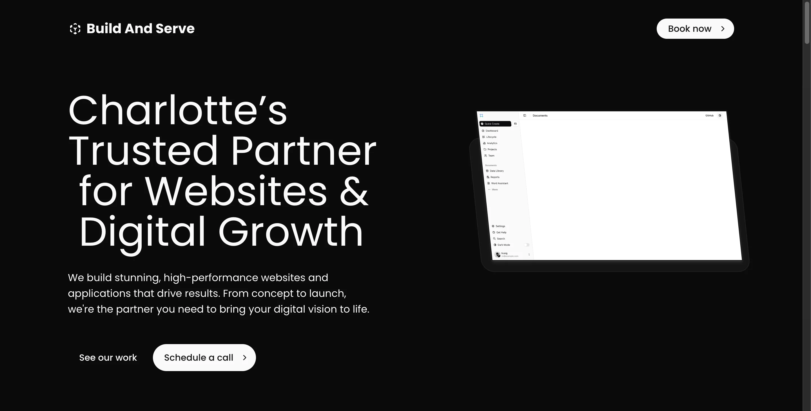
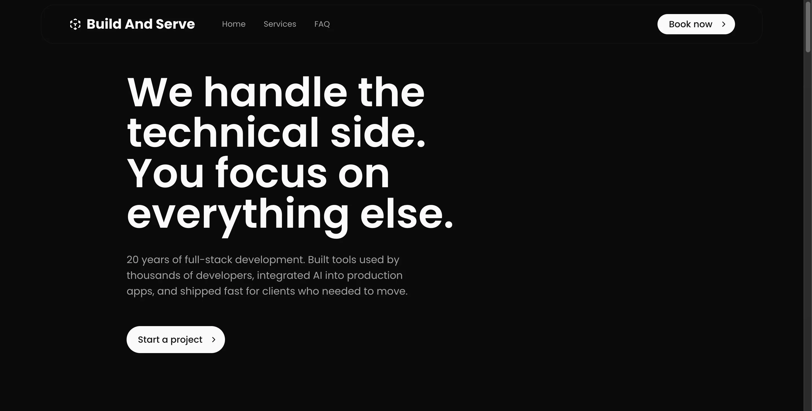
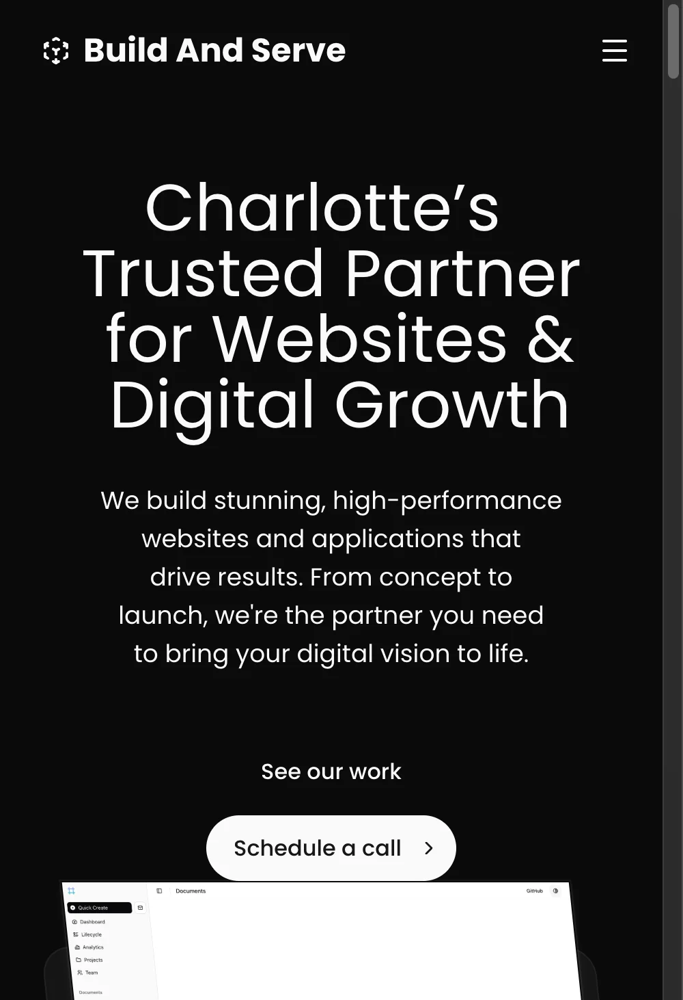

# Build And Serve

Charlotte's trusted partner for websites & digital growth. High-performance websites and applications — from concept to launch.

Made with ❤️ by [Lacy](https://lacy.sh)

## Screenshots



<p align="center">
  
  &nbsp;
  
</p>

## Deploy in 30 Seconds

[](https://vercel.com/new/clone?repository-url=https%3A%2F%2Fgithub.com%2Flacymorrow%2Fbuildandserve&project-name=buildandserve&repository-name=buildandserve&redirect-url=https%3A%2F%2Fbuildandserve.com&production-deploy-hook=Build%20And%20Serve%20Deploy&demo-title=Build%20And%20Serve%20Preview&demo-description=Charlotte%27s%20trusted%20partner%20for%20websites%20%26%20digital%20growth.%20High-performance%20websites%20and%20applications.&demo-url=https%3A%2F%2Fbuildandserve.com&demo-image=%2F%2Fbuildandserve.com%2Fimages%2Fpreview.png)

[](https://pr.new/lacymorrow/buildandserve)

No environment variables needed to start! The setup wizard guides you through configuration after deployment.

## What's Included

- 🔐 **Authentication** - Auth.js, Better Auth, Clerk, Supabase, Stack ([details](docs/features/authentication.mdx))
- 💳 **Payments** - Lemon Squeezy, Stripe, Polar ([details](docs/features/payments.mdx))
- 📝 **CMS** - Payload CMS v3 ([details](docs/features/cms.mdx))
- 🎨 **Visual Editor** - Builder.io ([details](docs/features/visual-builder.mdx))
- 📧 **Email** - Resend + magic links ([details](docs/features/email.mdx))
- 🤖 **AI** - Browser-based SmolLM + OpenAI/Anthropic ([details](docs/features/ai.mdx))
- 🎯 **Analytics** - PostHog, Umami, Google, Statsig ([details](docs/features/analytics.mdx))
- 💾 **Database** - PostgreSQL + Drizzle ORM ([details](docs/features/database.mdx))
- 📦 **Storage** - AWS S3, Vercel Blob ([details](docs/features/storage.mdx))
- 🚀 **Performance** - Edge-optimized with caching ([details](docs/guides/caching.mdx))

## Stack

- ⚡️ [Next.js 15](https://nextjs.org) - App Router
- 🎨 [Tailwind CSS](https://tailwindcss.com) + [Shadcn/UI](https://ui.shadcn.com)
- 🛠 [Drizzle ORM](https://orm.drizzle.team) - Type-safe database
- 📝 [Payload CMS v3](https://payloadcms.com) - Content management
- 🎨 [Builder.io](https://builder.io) - Visual editing
- 📧 [Resend](https://resend.com) - Email

## Quick Start

```bash
git clone https://github.com/lacymorrow/buildandserve
cd buildandserve
bun install --frozen-lockfile
bun dev
```

## Documentation

- 📚 [Full Documentation](docs/index.mdx)
- 🚀 [Deploy Guide](docs/getting-started/deploy.mdx)
- 🔧 [Development Guide](docs/development/index.mdx)
- 🤖 [AI Assistant Guide](CLAUDE.md)

## Support

- 💬 [GitHub Discussions](https://github.com/lacymorrow/buildandserve/discussions)
- 🐦 [Follow Updates](https://twitter.com/lacybuilds)
- 📧 [Contact](https://buildandserve.com/contact)
- 🌐 [Website](https://buildandserve.com)

## Found a bug?

[GitHub Issues](https://github.com/lacymorrow/buildandserve/issues)

## License

MIT - see [LICENSE](LICENSE)
